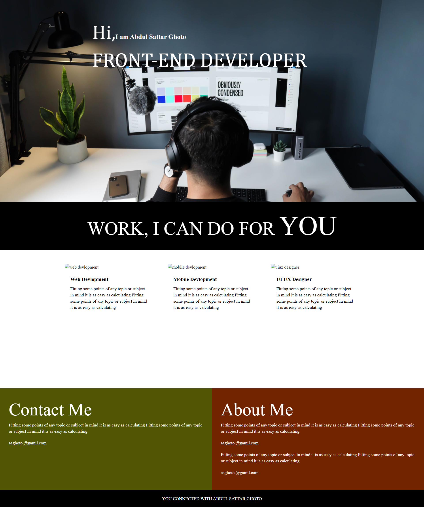

# 🚀 **Developer Landing Page**

Welcome to my **Developer Landing Page**! This sleek and modern landing page is crafted to showcase my skills as a **Front-End Developer**. With its **HTML & CSS** structure, it provides a visually appealing and **responsive layout**, ensuring a smooth experience on any device.

## 🌟 **Features**

- 📱 **Responsive Design**: Optimized for mobile, tablet, and desktop devices.
- 👋 **Hero Section**: A captivating intro with a personal greeting and job title.
- 💻 **Work Section**: Showcases areas of expertise like:
  - **Web Development**
  - **Mobile Development**
  - **UI/UX Design**
- 📞 **Contact Section**: Includes a contact form and my email for communication.
- 📜 **About Me Section**: A brief overview of my skills and experience.

## 🛠️ **Technologies Used**

- **HTML5**: For structure and layout.
- **CSS3**: For styling and presentation.
- 📱 **Responsive Design**: Ensures adaptability to all screen sizes.

## 📷 **Screenshots**

  

## ⚡ **How to Use**

1. Clone this repository:
   ```bash
   git clone https://github.com/absattarghoto/developer_page.git
